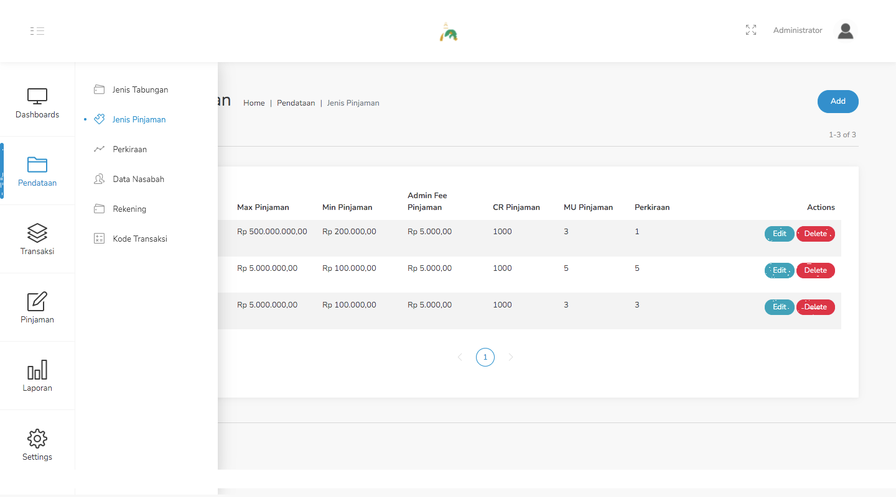
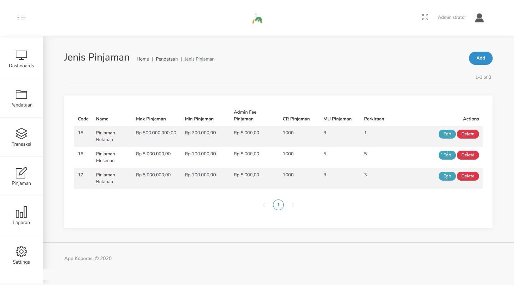
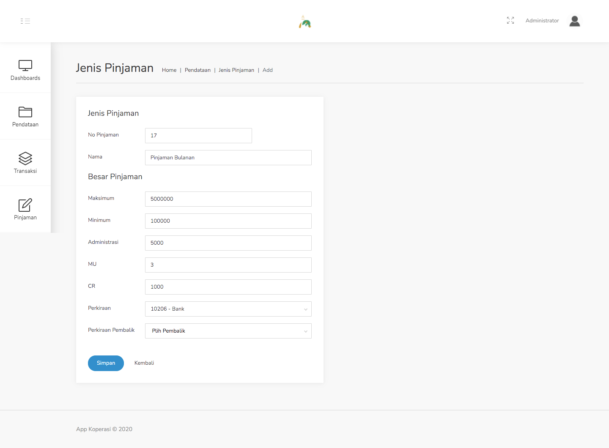
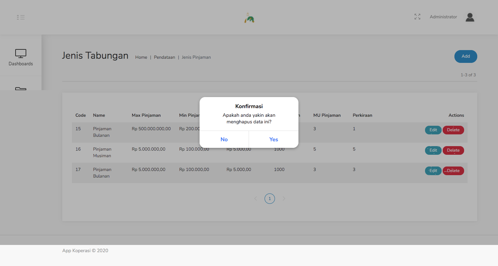

#### 1.2. Jenis Pinjaman
Jenis Pinjaman adalah fitur untuk mengajukan pinjaman.

Langkah - langkah untuk menambahkan data pinjaman :
1. Pilih menu Pendataan - Jenis Pinjaman.

    

2. Klik tombol Add di pojok kanan atas tabel.

    

3. Isilah data pada form yang muncul.

    

4. Setelah itu klik Simpan, data yang diinput akan tampil pada halaman tabel Jenis Pinjaman

Langkah - langkah untuk meng-edit data pinjaman :
1. Pilih menu Pendataan - Jenis Pinjaman.

    

2. Klik tombol Edit pada data yang ingin diubah.

    

3. Data yang dipilih tadi, akan muncul dalam tampilan form.

    

4. Setelah selesai meng-edit, klik tombol Simpan.

Langkah - langkah untuk menghapus data pinjaman :
1. Pilih menu Pendataan - Jenis Pinjaman.

    

2. Klik tombol Delete pada data yang ingin dihapus.

    

3. Setelah muncul *pop-up* konfirmasi, pilih Yes.

    

4. Data terhapus.