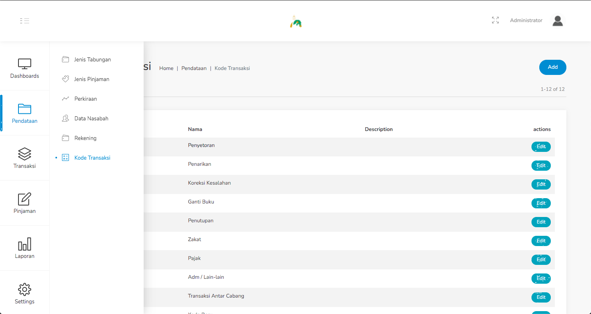
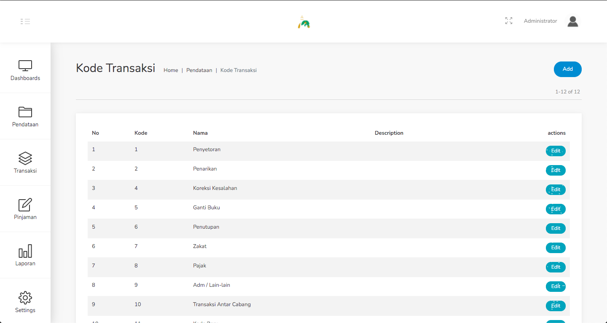
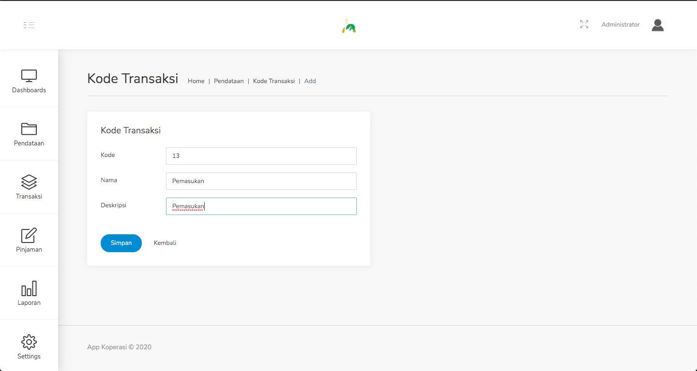
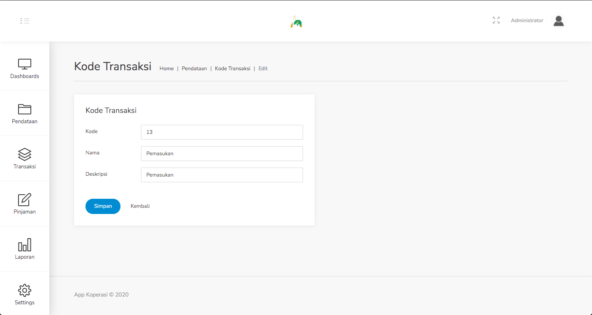

#### 1.6. Kode Transaksi
Pada menu ini terdapat data - data dari semua kode transaksi.

Langkah - langkah untuk menambahkan kode transaksi :
1. Pilih menu Pendataan - Kode Transaksi.

    

2. Klik tombol Add dipojok kanan atas.

    

3. Isilah data kode transaksi pada form yang disediakan.

    

4. Klik Simpan.

Langkah - langkah untuk meng-edit kode transaksi :
1. Pilih menu Pendataan - Kode Transaksi.

    

2. Klik tombol Edit pada data yang ingin diubah.

    

3. Sesuaikan kembali data pada form edit.

    

4. Jika sudah sesuai, klik Simpan.