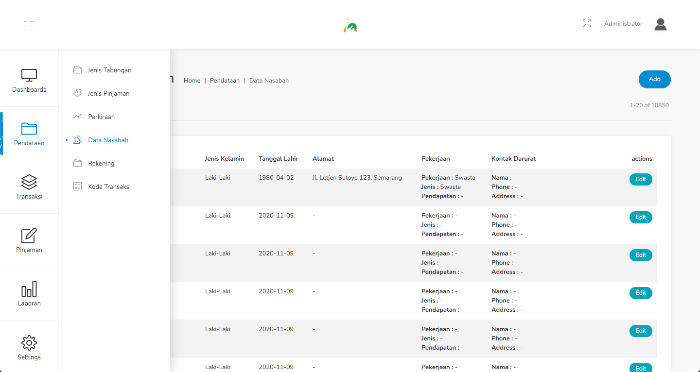
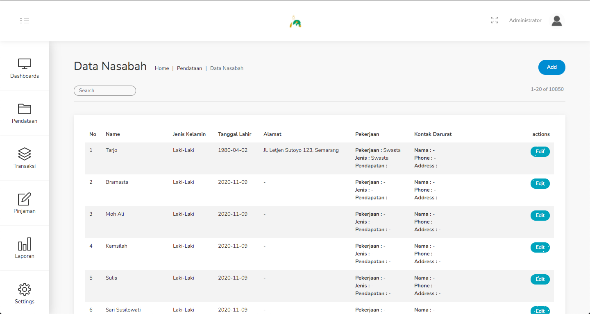
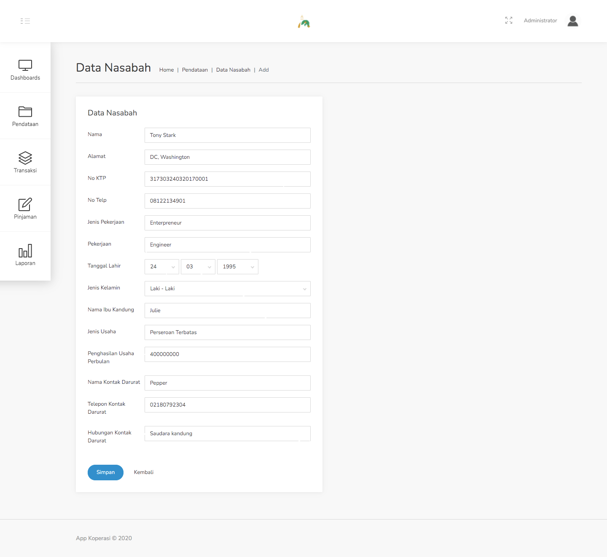
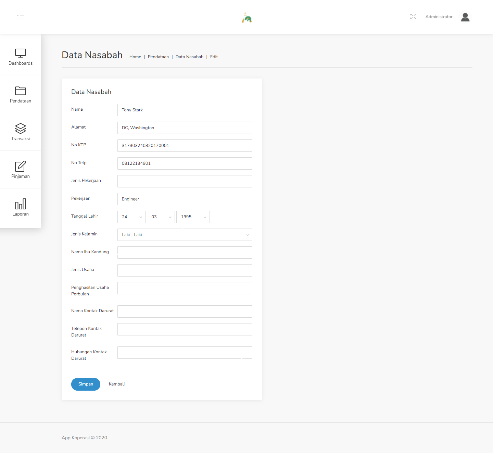
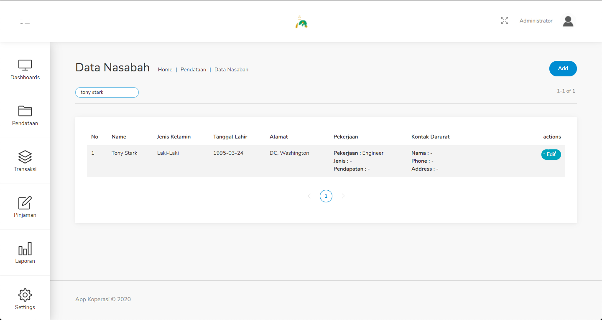

#### 1.4. Data Nasabah
Pada menu ini, kita dapat menambah, serta mengubah data para nasabah.

Langkah - langkah untuk menambahkan data nasabah :
1. Pilih menu Pendataan - Data Nasabah.

    

2. Klik tombol Add dipojok kanan atas.

    

3. Isilah data nasabah sesuai dengan form yang disediakan.

    

4. Klik simpan.

Langkah - langkah untuk meng-edit data nasabah :
1. Pilih menu Pendataan - Data Nasabah.

    

2. Klik tombol Edit pada data yang ingin diubah.

    

3. Sesuaikan kembali data nasabah yang ingin diubah.

    

4. Jika perubahan sudah dilakukan, klik Simpan.

Pada menu Data Nasabah, terdapat field search yang berguna untuk mencari data spesifik. Untuk filternya mengacu pada nama nasabah.

Langkah - langkah untuk mencari data nasabah :
1. Pilih menu Pendataan - Data Nasabah.

    

2. Pada field search, ketikkan nama nasabah yang ingin dicari.

    

3. Tanpa harus melakukan enter, data yang dicari akan muncul pada tabel data nasabah.

    
