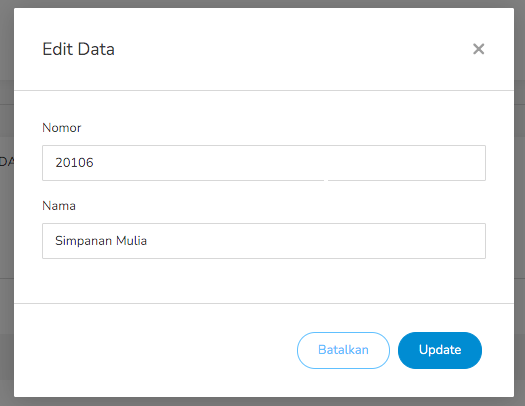
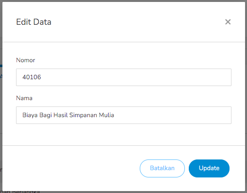

#### 1.3. Perkiraan
Pada menu ini terdapat 4 jenis data yaitu, Aktiva, Pasiva, Biaya, dan Pendapatan.

Langkah - langkah untuk menambahkan data Aktiva :
1. Pilih menu Pendataan - Perkiraan.

    

2. Pilih Tab Aktiva, kemudian klik tombol Add.

    

3. Setelah tombol Add diklik, akan muncul *pop-up* form untuk menambah Aktiva baru.

    

4. Jika form sudah diisi, klik Simpan.

Langkah - langkah untuk meng-edit data Aktiva :
1. Pilih menu Pendataan - Perkiraan.

    

2. Pilih Tab Aktiva, kemudian klik tombol Edit pada data yang ingin diubah.

    

3. Setelah tombol Edit diklik, akan muncul *pop-up* form untuk mengubah data Aktiva.

    

4. Jika perubahan sudah dilakukan, klik Simpan.

Langkah - langkah untuk menghapus data Aktiva :
1. Pilih menu Pendataan - Perkiraan.

    

2. Pilih Tab Aktiva, kemudian klik tombol Delete pada data yang ingin dihapus.

    

3. Setelah tombol Delete diklik, akan muncul *pop-up* konfirmasi untuk menghapus data.

    

4. Klik Yes untuk menghapus, No untuk membatalkan aksi.

Langkah - langkah untuk menambahkan data Pasiva :
1. Pilih menu Pendataan - Perkiraan.

    

2. Pilih Tab Pasiva, kemudian klik tombol Add.

    

3. Setelah tombol Add diklik, akan muncul *pop-up* form untuk menambah Pasiva baru.

    

4. Jika form sudah diisi, klik Simpan.

Langkah - langkah untuk meng-edit data Pasiva :
1. Pilih menu Pendataan - Perkiraan.

    

2. Pilih Tab Pasiva, kemudian klik tombol Edit pada data yang ingin diubah.

    

3. Setelah tombol Edit diklik, akan muncul *pop-up* form untuk mengubah data Pasiva.

    

4. Jika perubahan sudah dilakukan, klik Simpan.

Langkah - langkah untuk menghapus data Pasiva :
1. Pilih menu Pendataan - Perkiraan.

    

2. Pilih Tab Pasiva, kemudian klik tombol Delete pada data yang ingin dihapus.

    

3. Setelah tombol Delete diklik, akan muncul *pop-up* konfirmasi untuk menghapus data.

    

4. Klik Yes untuk menghapus, No untuk membatalkan aksi.

Langkah - langkah untuk menambahkan data Biaya :
1. Pilih menu Pendataan - Perkiraan.

    

2. Pilih Tab Biaya, kemudian klik tombol Add.

    

3. Setelah tombol Add diklik, akan muncul *pop-up* form untuk menambah Biaya baru.

    

4. Jika form sudah diisi, klik Simpan.

Langkah - langkah untuk meng-edit data Biaya :
1. Pilih menu Pendataan - Perkiraan.

    

2. Pilih Tab Biaya, kemudian klik tombol Edit pada data yang ingin diubah.

    

3. Setelah tombol Edit diklik, akan muncul *pop-up* form untuk mengubah data Biaya.

    

4. Jika perubahan sudah dilakukan, klik Simpan.

Langkah - langkah untuk menghapus data Biaya :
1. Pilih menu Pendataan - Perkiraan.

    

2. Pilih Tab Biaya, kemudian klik tombol Delete pada data yang ingin dihapus.

    

3. Setelah tombol Delete diklik, akan muncul *pop-up* konfirmasi untuk menghapus data.

    

4. Klik Yes untuk menghapus, No untuk membatalkan aksi.

Langkah - langkah untuk menambahkan data Pendapatan :
1. Pilih menu Pendataan - Perkiraan.

    

2. Pilih Tab Pendapatan, kemudian klik tombol Add.

    

3. Setelah tombol Add diklik, akan muncul *pop-up* form untuk menambah Pendapatan baru.

    

4. Jika form sudah diisi, klik Simpan.

Langkah - langkah untuk meng-edit data Pendapatan :
1. Pilih menu Pendataan - Perkiraan.

    

2. Pilih Tab Pendapatan, kemudian klik tombol Edit pada data yang ingin diubah.

    

3. Setelah tombol Edit diklik, akan muncul *pop-up* form untuk mengubah data Pendapatan.

    

4. Jika perubahan sudah dilakukan, klik Simpan.

Langkah - langkah untuk menghapus data Pendapatan :
1. Pilih menu Pendataan - Perkiraan.

    

2. Pilih Tab Pendapatan, kemudian klik tombol Delete pada data yang ingin dihapus.

    

3. Setelah tombol Delete diklik, akan muncul *pop-up* konfirmasi untuk menghapus data.

    

4. Klik Yes untuk menghapus, No untuk membatalkan aksi.