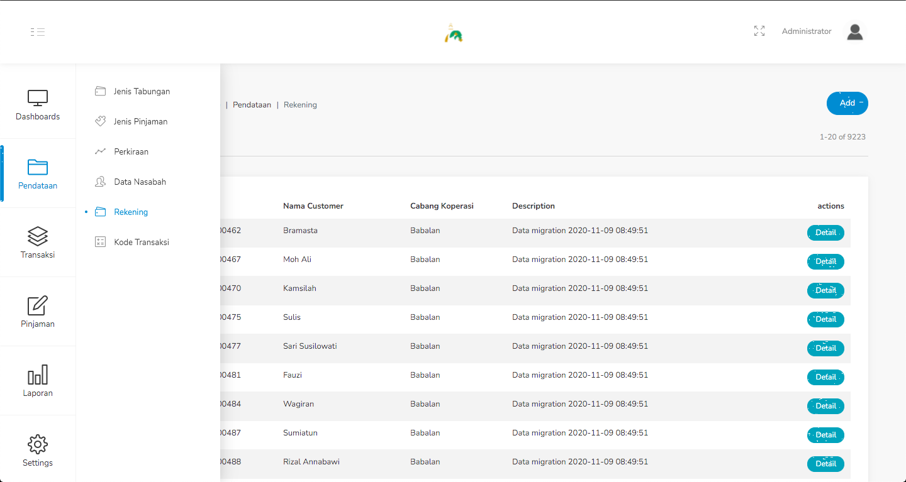

#### 1.5. Rekening
Pada menu ini terdapat data - data dari rekening para nasabah.

Langkah - langkah untuk menambahkan data rekening nasabah :
1. Pilih menu Pendataan - Rekening.

    

2. Klik tombol Add dipojok kanan atas.

    

3. Isilah data rekening nasabah pada form yang disediakan.

    

4. Klik simpan

Pada menu Rekening, terdapat field search yang berguna untuk mencari data spesifik. Untuk filternya mengacu pada nama nasabah dan nomor rekening nasabah.

Langkah - langkah untuk mencari data rekening nasabah :
1. Pilih menu Pendataan - Rekening.

    

2. Pada field search, ketikkan nama nasabah yang ingin dicari.

    

3. Atau dapat mencari menggunakan nomor rekening nasabah.

    

Untuk data rekening nasabah dapat dilihat rinciannya dengan menekan tombol detail pada tabel data rekening nasabah.

