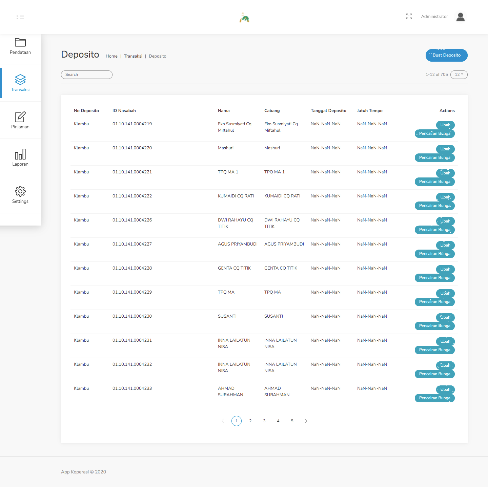
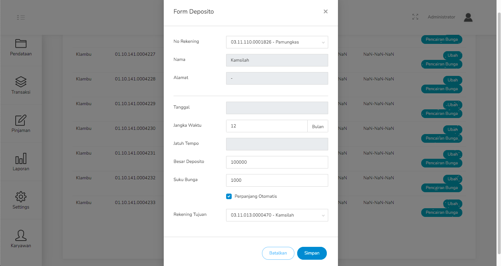

#### 2.8. Deposito

Langkah - langkah untuk meng-input deposito :
1. Pilih menu Transaksi - Deposito

    

2. Klik Buat Deposito

3. Isilah data pada saat form muncul, sebagai contoh lihat gambar dibawah ini.

    

4. Klik Simpan.