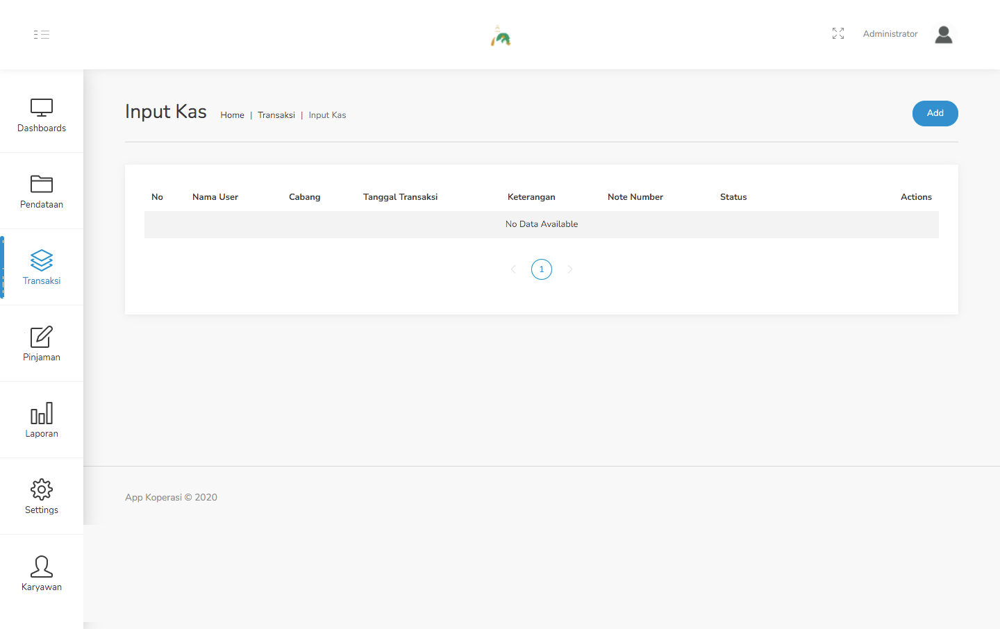
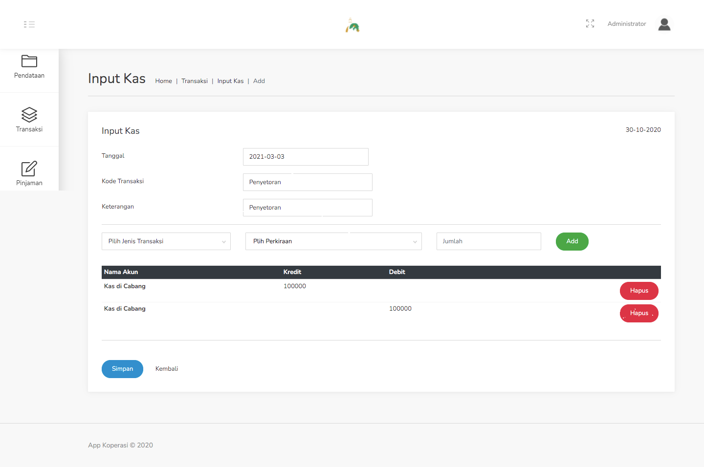

#### 2.7. Input Kas

Langkah - langkah untuk meng-input kas :
1. Pilih menu Transaksi - Input Kas.

    

2. Klik tombol Add.

3. Isi data pada form yang muncul dihalaman input seperti gambar dibawah ini.

    

4. Klik Simpan.