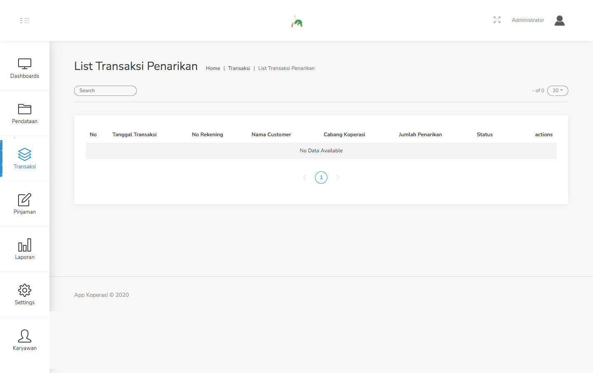
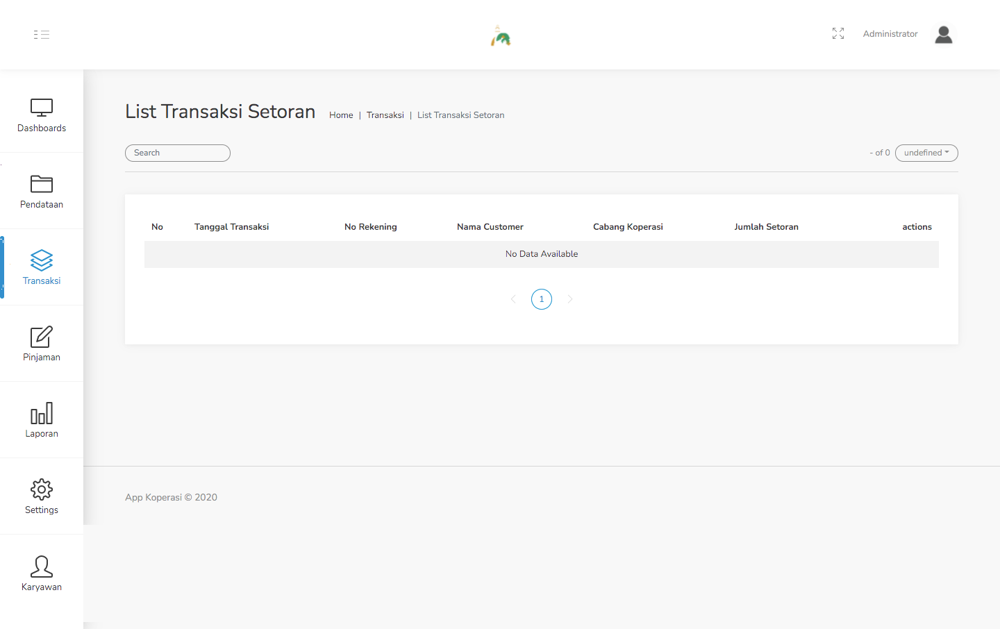
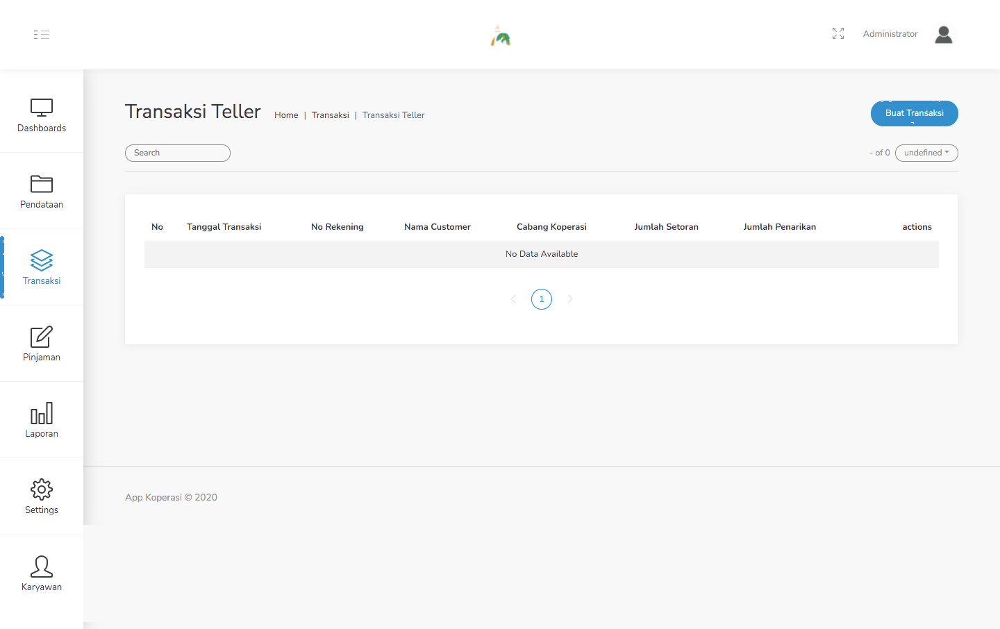
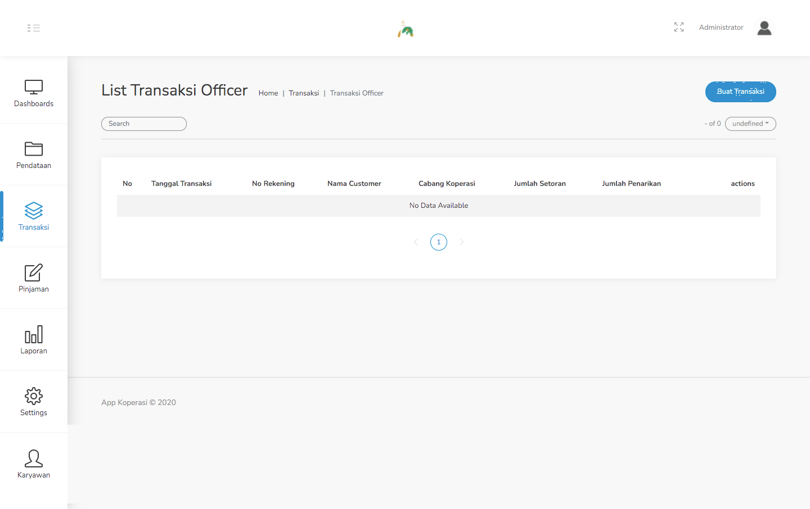

#### 2.3. List Transaksi Penarikan

Pada menu ini terdapat data dari berbagai transaksi penarikan. Untuk tampilan halaman tersebut dapat dilihat pada gambar dibawah ini.

#### 2.4. List Transaksi Setoran

Pada menu ini terdapat data dari berbagai transaksi setoran. Untuk tampilan halaman tersebut dapat dilihat pada gambar dibawah ini.

#### 2.5. Transaksi Teller

Pada menu ini terdapat data dari berbagai transaksi yang dilakukan oleh teller. Untuk tampilan halaman tersebut dapat dilihat pada gambar dibawah ini.

#### 2.6. Transaksi Officer

Pada menu ini terdapat data dari berbagai transaksi yang dilakukan oleh officer. Untuk tampilan halaman tersebut dapat dilihat pada gambar dibawah ini.

