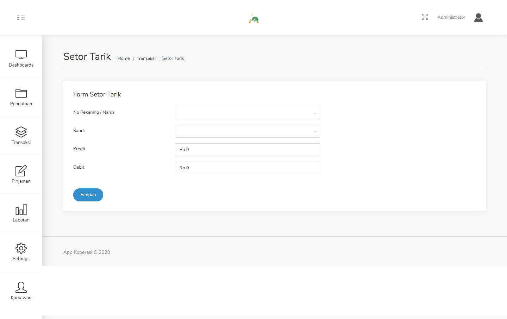
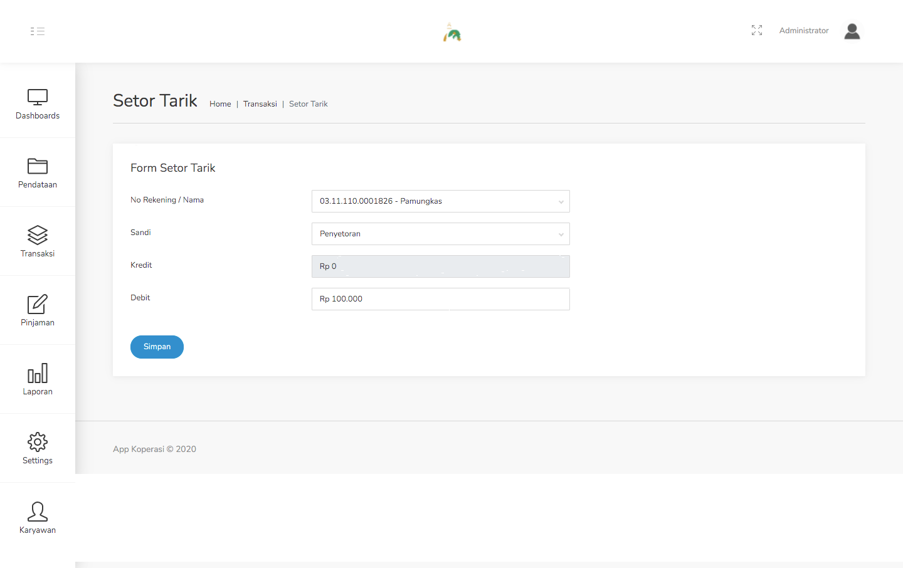

### 2. Menu Transaksi

##### 2.1. Setor Tarik

Langkah - langkah untuk mengisi form Setor Tarik :
1. Pilih menu Transaksi - Setor Tarik.

    

2. Isilah data pada form yang muncul.

    

3. Setelah itu klik simpan.