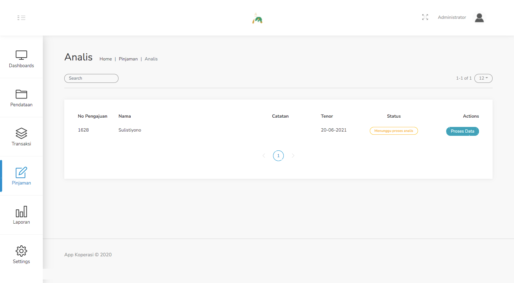
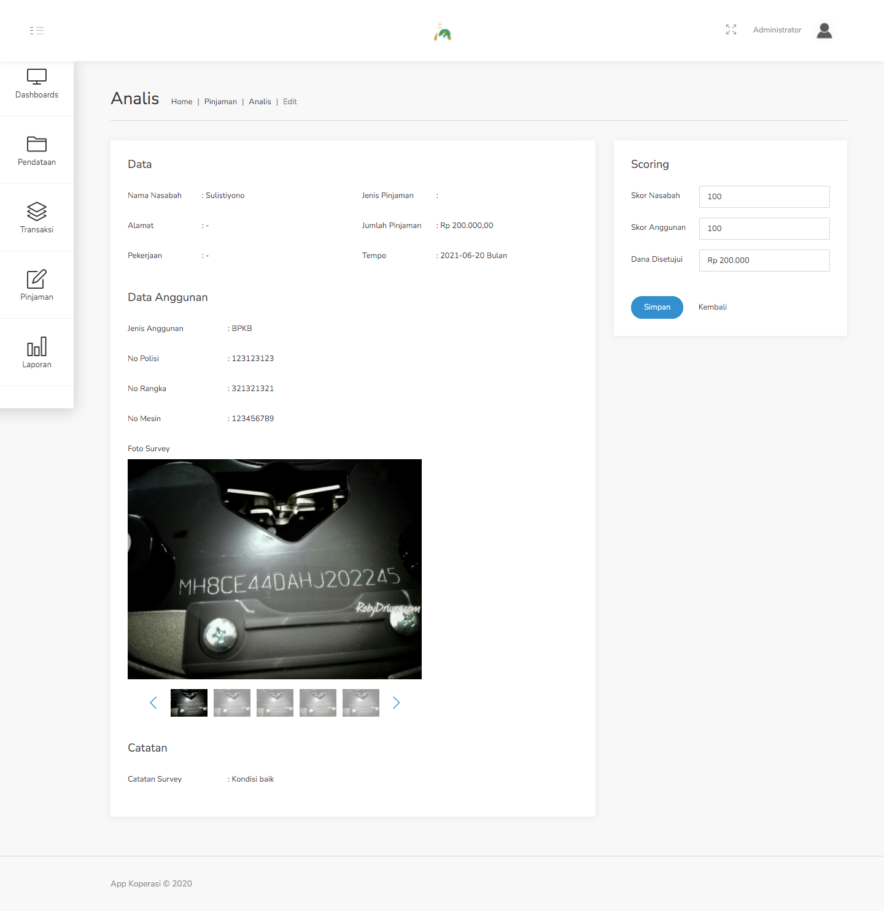

#### 3.3. Analis
Menu ini adalah lanjutan dari menu sebelumnya, yakni Survey. Setelah melakukan survey, dilakukan analisis terhadap hasil survey tersebut.

Langkah - langkah untuk melakukan analisis terhadap survey yang telah dilakukan :
1. Pilih menu Pinjaman - Analis, lalu pilih data dari nasabah yang sudah melalui proses Survey.

    

2. Klik tombol Proses Data pada baris data tersebut. Setelah diklik akan muncul form seperti gambar dibawah ini.

    

3. Pada form tersebut terdapat beberapa informasi singkat terkait data nasabah, data anggunan, serta catatan dari hasil survey yang telah dilakukan. Data tersebut yang nantinya akan dianalisis lalu diberi skor serta menentukan keputusan berapakah data yang disetujui.

4. Jika sudah, maka klik tombol Selesai.