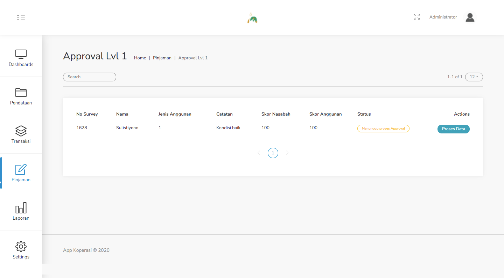
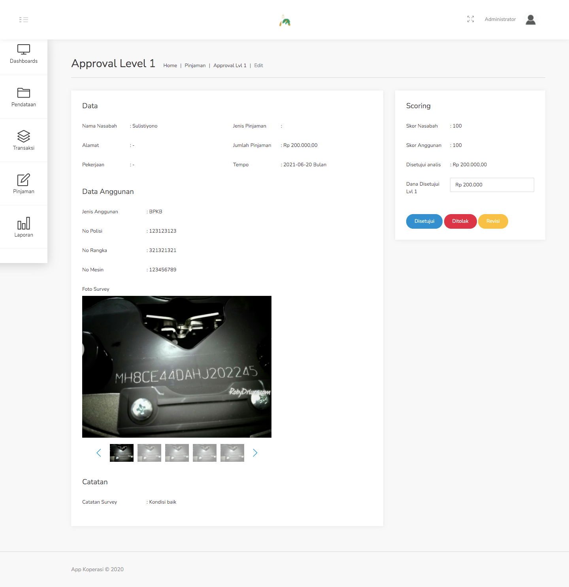

#### 3.4. Approval Lvl 1
Menu ini adalah lanjutan dari menu sebelumnya, yakni Analis. Setelah data pinjaman selesai di survey dan di analisis, langkah selanjutnya adalah Approval Lvl 1.

Langkah - langkah untuk melakukan Approval Lvl 1 :
1. Pilih menu Pinjaman - Approval Lvl 1.

    

2. Pilih data yang ingin di proses (Approve) dengan klik tombol Proses Data, pada contoh kasus kali ini, data yang kita pilih adalah atas nama Sulistiyono.

    

3. Pada form approval ini, terdapat beberapa informasi sebagai bahan pertimbangan apakah pengajuan ini disetujui atau tidak. Terdapat 3 aksi yang telah disediakan, yakni Disetujui, Ditolak, atau Revisi.