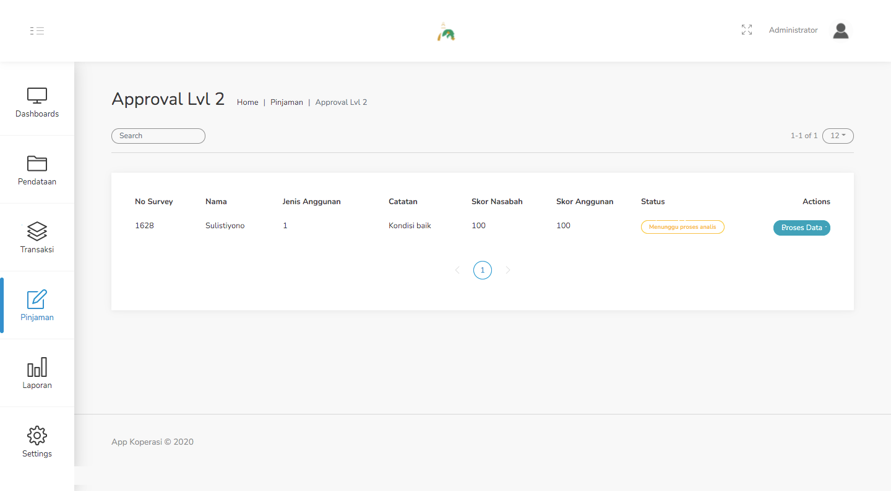
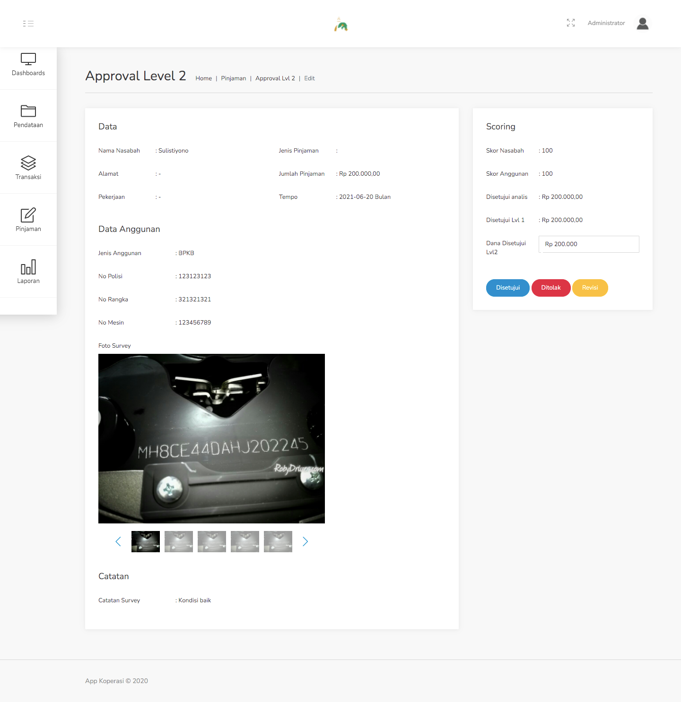

#### 3.5. Approval Lvl 2
Menu ini adalah menu lanjutan dari Approval Lvl 1. Setelah data pinjaman di Approve oleh level 1, makan selanjutnya adalah persetujuan dari Approval Lvl 2.

Secara garis besar, proses approval level 2 ini hampir sama dengan level 1, hanya saja terdapat tambahan informasi terkait jumlah dana yang disetujui oleh approval level 1.

Langkah - langkah untuk melakukan Approval Lvl 2 :
1. Pilih menu Pinjaman - Approval Lvl 2.

    

2. Pilih data yang ingin di proses (Approve Lvl 2) dengan klik tombol Proses Data, pada contoh kasus kali ini, data yang kita pilih adalah atas nama Sulistiyono.

    

3. Pada form approval ini, terdapat beberapa informasi sebagai bahan pertimbangan apakah pengajuan ini disetujui atau tidak. Terdapat 3 aksi yang telah disediakan, yakni Disetujui, Ditolak, atau Revisi.