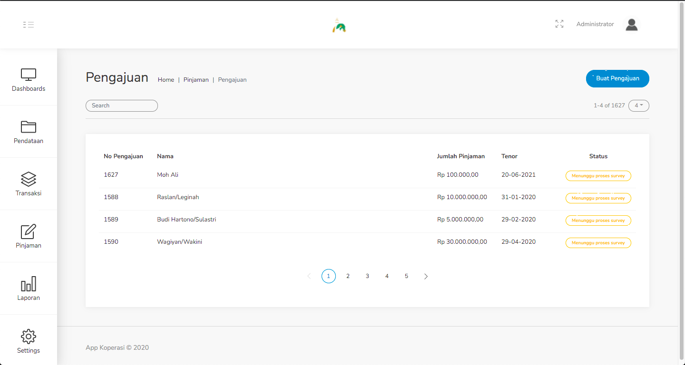
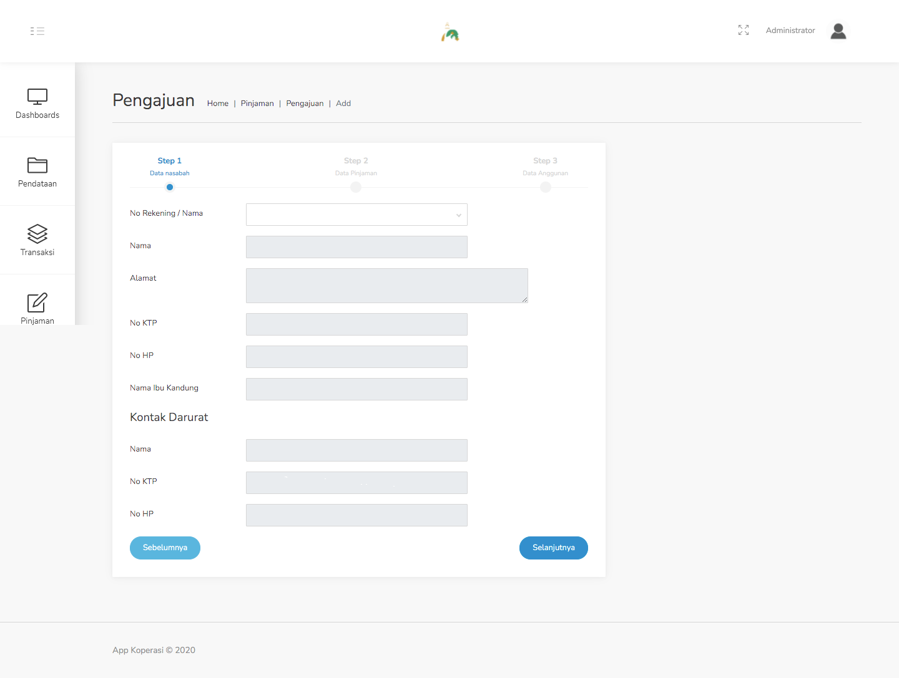
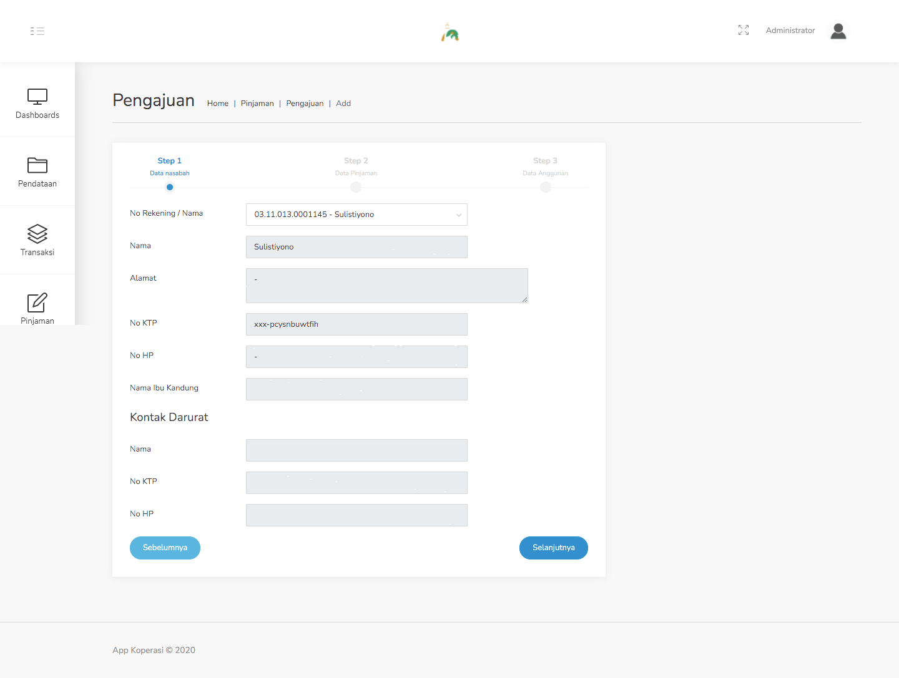
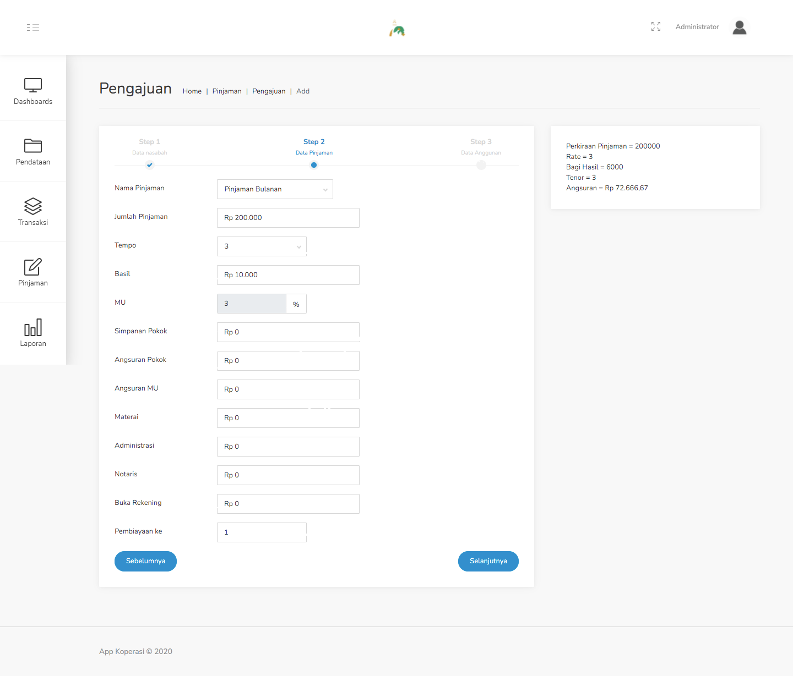
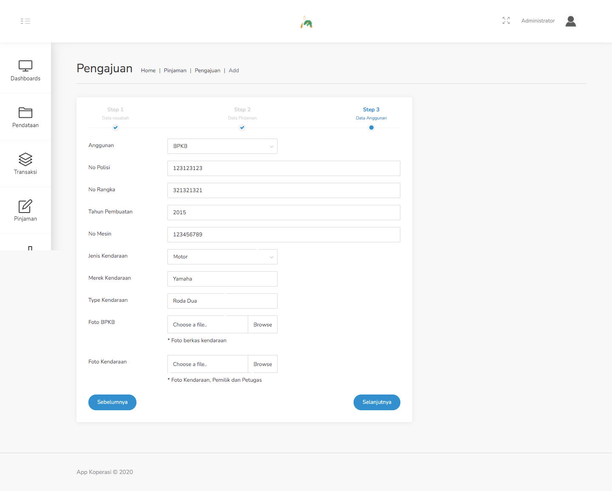
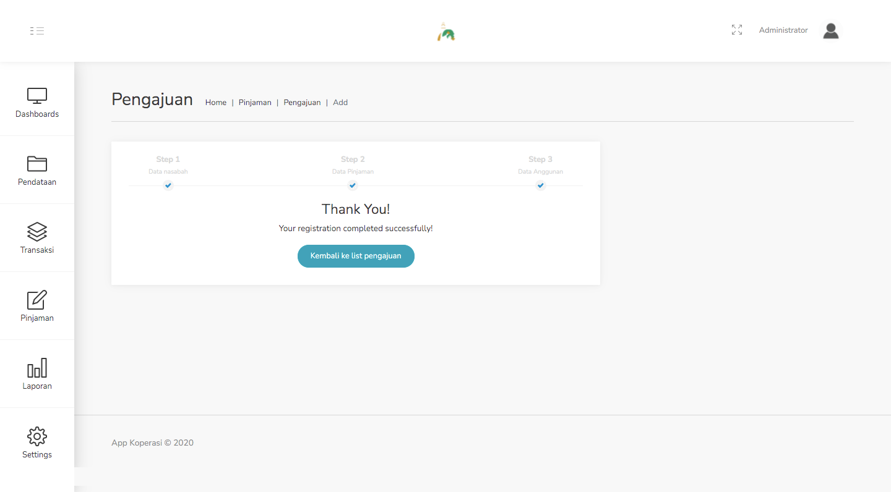

### 3. Menu Pinjaman

#### 3.1. Pengajuan
Menu ini digunakan untuk nasabah yang ingin melakukan pengajuan pinjaman.

Langkah - langkah untuk mengajukan pinjaman :
1. Pilih menu Pinjaman - Pengajuan.

    

2. Klik tombol Buat Pengajuan pada pojok kanan atas tabel, lalu akan muncul form seperti gambar dibawah ini.

    

3. Lalu pilihlah nasabah yang ingin mengajukan pinjaman pada kolom No Rekening / Nama. Setelah nasabah dipilih, akan muncul beberapa rincian data dari nasabah tersebut. Jika dirasa data sudah benar, klik tombol Selanjutnya.

    

4. Setelah itu akan muncul form lanjutan seperti gambar dibawah ini. Pilihlah jenis pinjamannya, lalu jumlah pinjamannya berapa. Pada bagian kanan, akan terlihat simulasi dari pinjaman seperti apa. Setelah itu isilah data penunjang lainnya melalui kolom-kolom yang tersedia.

    

5. Setelah form data pinjaman terisi, langkah selanjutnya adalah untuk mengisi data anggunan. Pilih jenis anggunan, BPKB atau Sertifikat Tanah. Setelah itu, isi data penunjang dari jenis anggunan yang dipilih.

    

6. Setelah semua form data anggunan sudah terisi dengan benar, klik tombol Selanjutnya, maka akan tampilan keterangan jika data sudah sukses ditambahkan.

    

7. Proses input data pengajuan selesai.