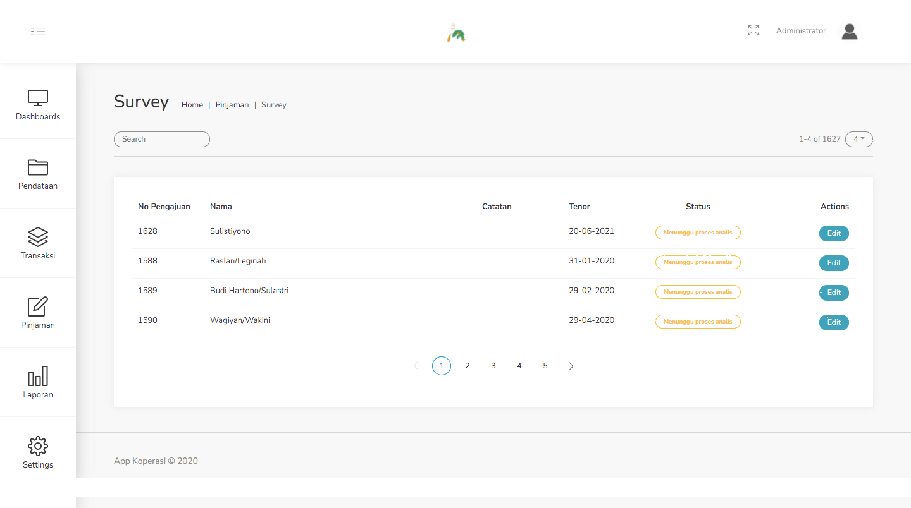
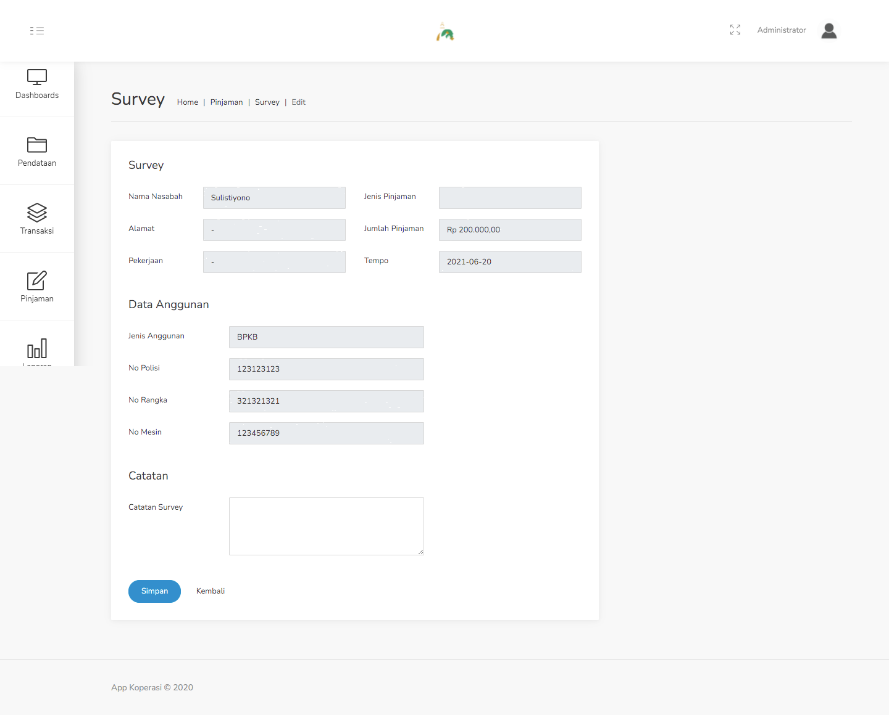

#### 3.2. Survey
Menu ini adalah tindak lanjut dari pengajuan pinjaman yang sudah dibuat pada menu Pengajuan. Semua data pinjaman yang telah dibuat di menu tersebut, membutuhkan survey terlebih dahulu untuk lanjut ke proses berikutnya.

Langkah - langkah untuk melakukan survey terhadap pengajuan pinjaman :
1. Pilih data peminjam yang sebelumnya telah kita inputkan pada tabel dibawah ini.

    

2. Pada contoh kasus kita, data yang kita input sebelumnya dengan nasabah atas nama Sulistiyono. Pilih data tersebut dengan klik tombol edit pada baris data. Pada tampilan form, terdapat satu buah kolom untuk mengisi catatan survey, berilah keterangan pada kolom itu terkait hasil survey yang telah dilakukan.

    

3. Jika sudah, maka pilih tombol Selesai, dan proses Survey telah selesai dilakukan.