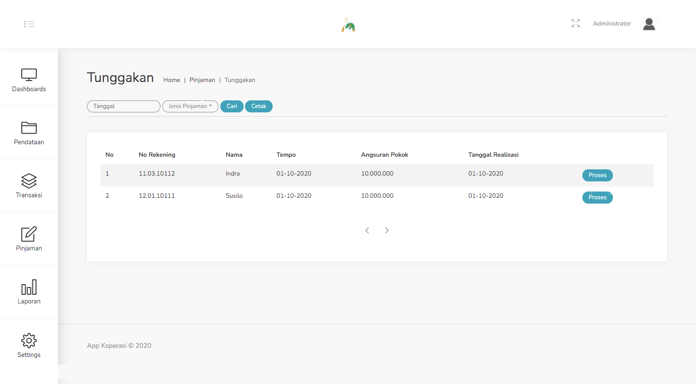

#### 3.7. Tunggakan
Menu ini berisi informasi dari nasabah yang melakukan tunggakan terhadap pinjaman yang telah diajukan sebelumnya.

Tujuan dari menu ini adalah untuk menindaklanjuti nasabah - nasabah yang melakukan penunggakan.

Langkah - langkah melakukan tindak lanjut :
1. Pilih menu Pinjaman - Tunggakan. Pada tampilan dibawah ini terdapat data dari nasabah yang melakukan penunggakan. Pilih salah satu dari data tersebut dengan klik tombol Proses.

    

2. Setelah diklik akan muncul form seperti gambar dibawah ini, isi form tersebut dengan ketentuan yang ada.

    

3. Setelah semua kolom terisi. Klik Selesai.